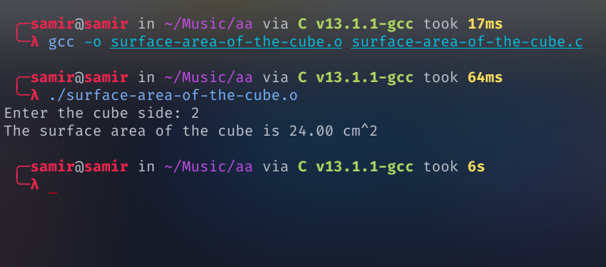

# Surface area of the cube


## Run Locally

Clone the project

```bash
  git clone hhttps://github.com/samirgaire10/surface-area-of-the-cube.git
```

Go to the project directory

```bash
  cd surface-area-of-the-cube 
  ```

compile c file

```bash
gcc -o surface-area-of-the-cube.o  surface-area-of-the-cube.c```

Run 
```bash
./surface-area-of-the-cube.o
```
## Screenshots


